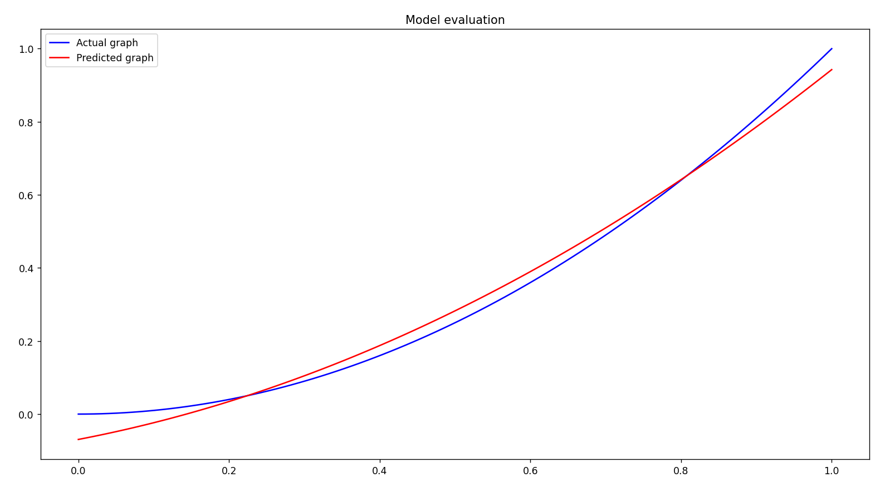

# Projectile Motion and Machine Learning

This project aims to accurately predict the maximum heights and ranges of projectiles given their initial velocities and
launch angles, while also building the underlying systems used to do this.

## Simulating projectile trajectory

In order to predict this information, the model requires training data. I simulated projectile trajectory (with air 
resistance) using numerical methods in two distinct ways. 

### (1) Forward Euler Method 

**What it does:** - Simulates projectile trajectory using a first order approximation method

**Key conepts** - Easy to code and understand but computationally expensive and can be numerically unstable and less 
accurate

Here is the graph demonstrating an example projectile trajectory of a padel ball with an initial speed of 30m/s and 
launch angle of 45 degrees:

Note - To learn and implement the Forward Euler method, I studied the following paper by Tomasz Chwiej: 
https://galaxy.agh.edu.pl/~chwiej/comp_phys/labs/1_projectile_launch.pdf

### (2) Runge-Kutta 4 Method

**What it does** - Simulates projectile trajectory using a fourth order method approximation method

**Key concepts** - Much more accurate and numerically stable than the Forward Euler method while also being less 
computationally expensive

Here is the graph for the trajectory of a padel ball with the same conditions but using the RK4 method:

## Building the Models

### (1) Linear Regression from scratch - Gradient Descent

**What it does** - Predicts the equation of a line given its 'x' and 'y' values using gradient descent

**Key concepts** - Can accurately predict linear equations but struggles with polynomial equations, requires fine-tuning
parameters such as learning rate, epochs and number of features and labels

Here is a graph showing the model predicting the linear equation 'y = 3x + 4'

Notice that the predicted line overlaps almost perfectly with the straight line 'y'. 

Here is a graph showing the model predicting the quadratic function 'y = x^2 + 4':

Note - the features and labels have been scaled to between 0 and 1. The model did not perform as well with a quadratic
function

### _Next iteration - Linear Regression using the normal equation_

