# Projectile Motion and Machine Learning

This project aims to accurately predict the maximum heights and ranges of projectiles given their initial velocities and
launch angles, while also building the underlying systems used to do this.

## Repo Structure

```
├── Machine_Learning_models/        
│   ├── linear_regression_normal.py  # Linear regression via the normal equation
│   ├── linear_regressionGD.py       # Linear regression via gradient descent
│   └── mlp.py                       # Multi-layer perceptron from scratch
├── Model_evaluation/
│   ├── config.py                    # Simulation constants (mass, drag coefficient, timestep, etc.)
│   ├── main_GD.py                   # Entry point: gradient descent linear regression pipeline
│   ├── main_mlp.py                  # Entry point: MLP training/evaluation pipeline
│   └── main_normal.py               # Entry point: normal equation linear regression pipeline
├── PM_Methods/
│   ├── forward_euler.py             # Forward Euler projectile simulator
│   ├── RK4.py                       # RK4 projectile simulator non vectorized for reference
│   └── vectorized_RK4.py            # Vectorized RK4 projectile simulator
├── images/                          # Saved plots referenced in this README
├── utils.py                         # Shared helper functions for normalising and denormalising values
├── requirements.txt
└── .gitignore
```

## How to Run

1. Clone the repo and install dependencies:
```bash
   git clone <repo-url>
   cd <repo-folder>
   pip install -r requirements.txt
```

2. Run one of the entry-point scripts from the project root:
```bash
   python Model_evaluation/main_normal.py  # Linear regression (normal equation)
   python Model_evaluation/main_GD.py      # Linear regression (gradient descent)
   python Model_evaluation/main_mlp.py      # MLP training and evaluation
```

3. Each script will print model weights/loss to the console and display evaluation plots via matplotlib.

4. Simulation parameters (mass, drag coefficient, timestep, sample size, etc.) can be adjusted in `Model_evaluation/config.py`.


## Simulating projectile trajectory

In order to predict this information, the model requires training data. I simulated projectile trajectory (with air 
resistance) using numerical methods in two distinct ways. 

### (1) Forward Euler Method 

**What it does:** - Simulates projectile trajectory using a first order approximation method

**Key concepts** - Easy to code and understand but computationally expensive and can be numerically unstable and less 
accurate

Graph demonstrating an example projectile trajectory of a padel ball with an initial speed of 30m/s and launch angle of 
45 degrees:

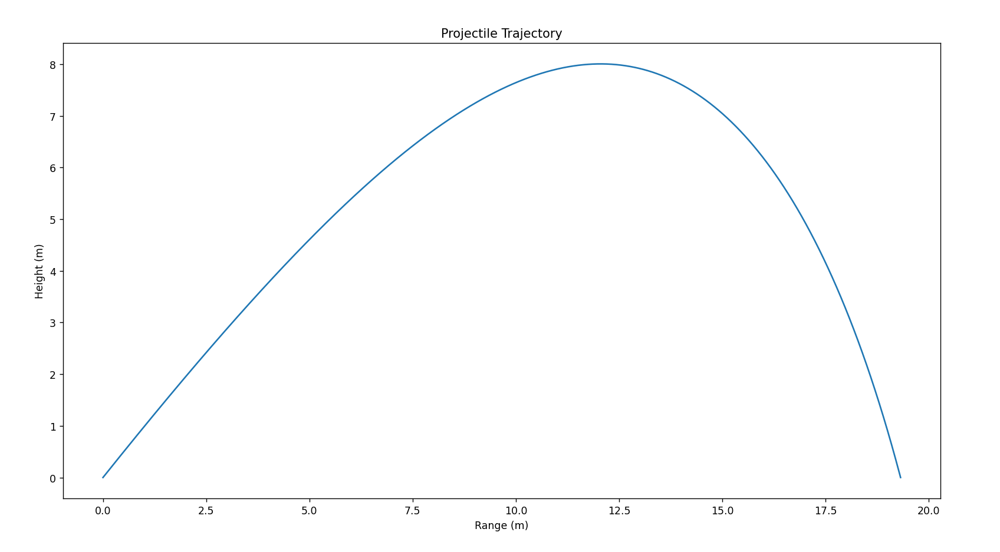
Note - To learn and implement the Forward Euler method, I studied the following paper by Tomasz Chwiej: 
https://galaxy.agh.edu.pl/~chwiej/comp_phys/labs/1_projectile_launch.pdf

### (2) Runge-Kutta 4 Method

**What it does** - Simulates projectile trajectory using a fourth order method approximation method

**Key concepts** - Much more accurate and numerically stable than the Forward Euler method while also being less 
computationally expensive

Graph for the trajectory of a padel ball with the same conditions but using the RK4 method:

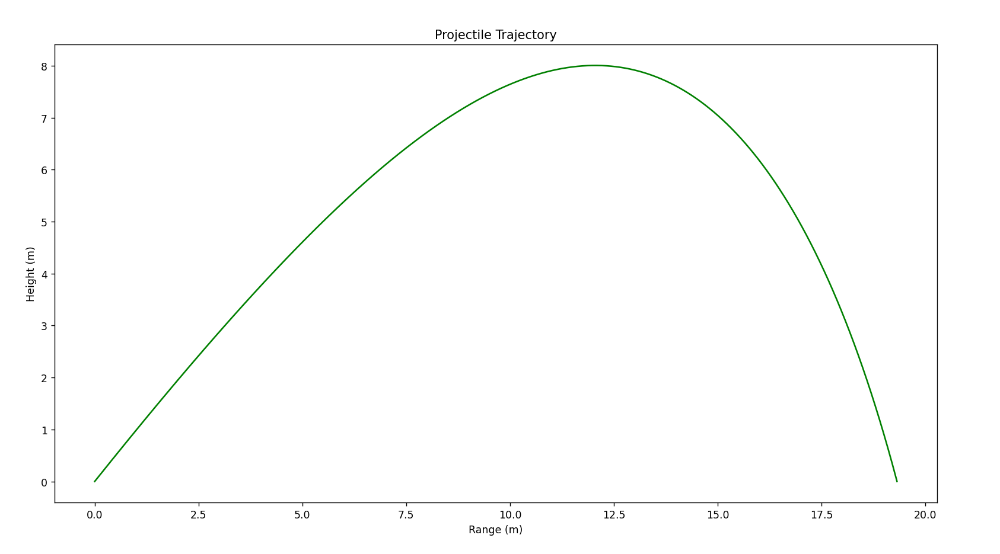


## Building the Models

### (1) Linear Regression from scratch - Gradient Descent

**What it does** - Predicts the equation of a line given its 'x' and 'y' values using gradient descent

**Key concepts** - Can accurately predict linear equations but struggles with polynomial equations, requires fine-tuning
parameters such as learning rate, epochs and number of features and labels

Graph showing the model predicting the linear equation 'y = 3x + 4'

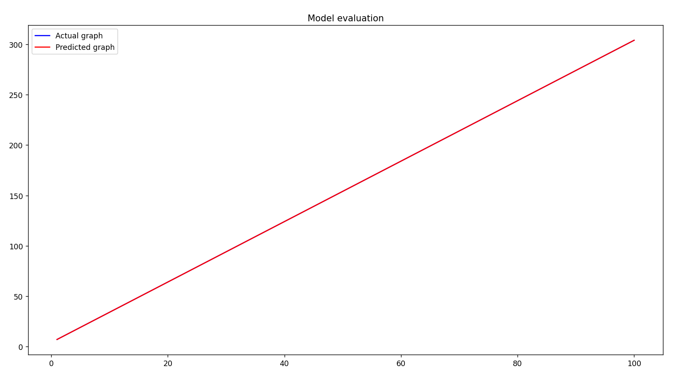
Notice that the predicted line overlaps almost perfectly with the straight line 'y'. 

Graph showing the model predicting the quadratic function 'y = x^2 + 4':

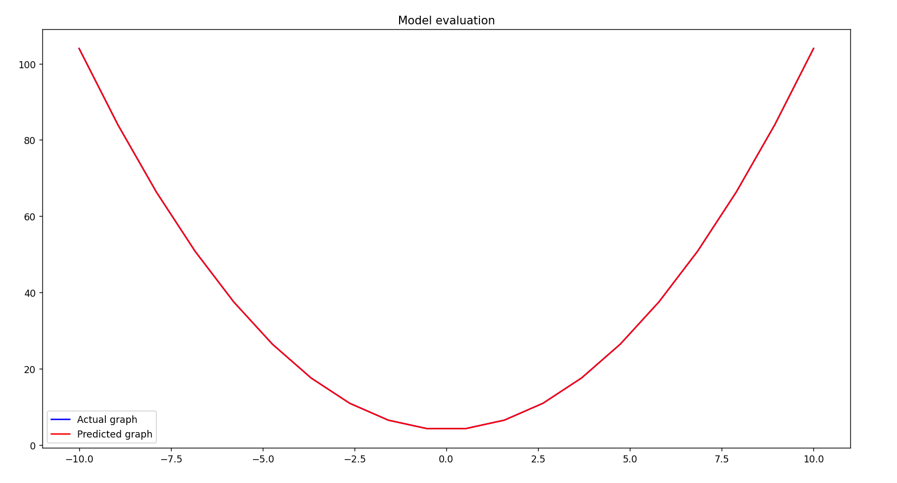
Note - The quadratic is not smooth and only has x values between -10 and 10. Any more than 20 x values and the model
runs into an overflow error when calculating the weights

### (2) Linear Regression from scratch - Normal equation

**What it does** - Predicts the equation of a line given the lines x and y values by calculating the exact weight in one
line

**Key concepts** - Perfectly predicts linear and polynomial equations and doesn't require fine-tuning any parameters - 
much more accurate than gradient descent especially for higher degree polynomials and doesn't require feature-scaling.

Graph showing the model's prediction of 'y = 3x + 4':

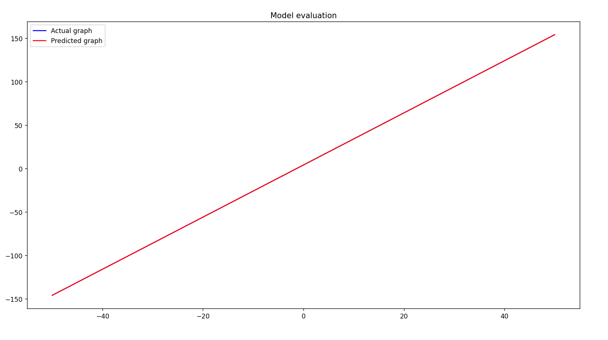

Graph showing the model's prediction of 'y = x^2 + 4':

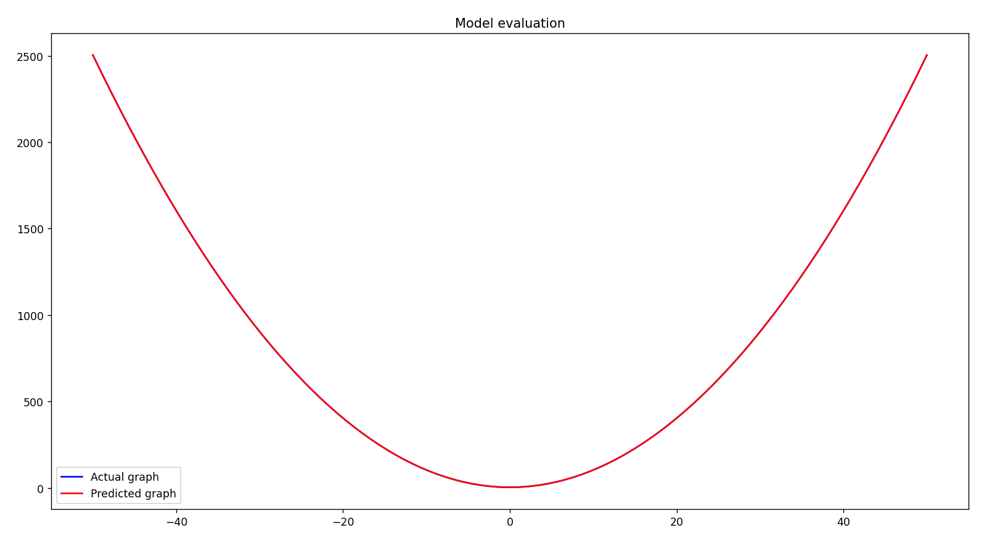
Notice how much smoother the curve is as compared to gradient descents version

### (3) Multi Layer Perceptron from scratch

**What it does** - Finds the relationship between data that allows the model to accurately predict the labels given the
input features. Utilises a feedforward network containing two hidden layers of sizes 8 and 4 respectively. Using ReLU
and trained with backpropagation to minimise mean squared error.

**Key concepts** - Is much better than regression model's as finding complex relationships between data, such as data
governed by a system of ordinary differential equations as in this project.


## Evaluating the models by predicting maximum height and range

### (1) Linear Regression using the normal equation

I implemented feature engineering using my knowledge of the physics equations to remove non-linearity. This way, the
model would have to predict a certain part of the equation, which once predicted, can be used to accurately calculate 
the ranges of maximum heights of the projectiles. This worked soundly without drag.

Below is a graph showing the model's predicted line against the actual line:

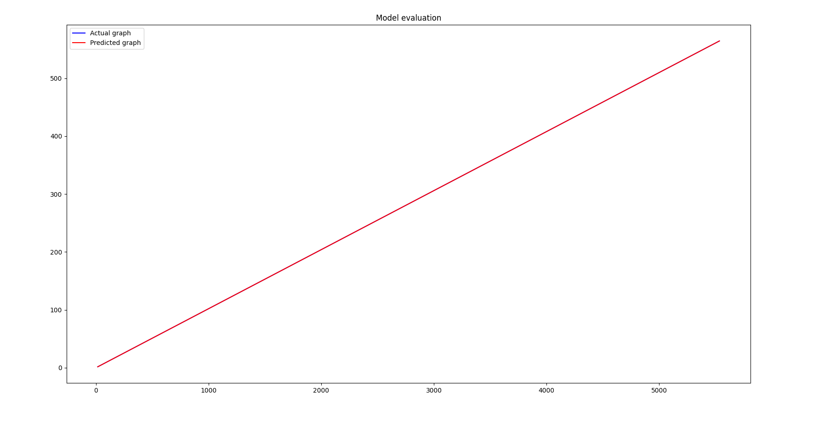
A perfect prediction

However, when air resistance was factored in, the graph became a mess:

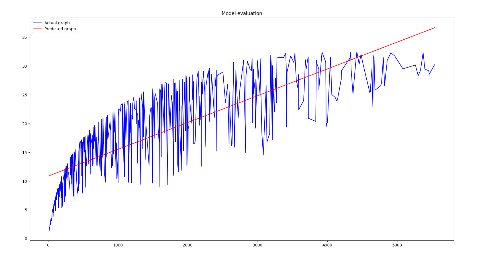
The regression model was sorely unable to grasp the complexity of the equations governing the data. This is because
the drag on the ball is not accurately captured with the single engineered feature I used. This allowed certain values 
launch speed and angle to produce a similar engineered feature yet wildly different drag, ultimately resulting in a 
difference range and maximum height for the projectile.

### (2) Using the Multi Layer Perceptron for predictions

I then trained and tested the MLP I built to predict the ranges and maximum heights. By normalising the data, I was able
to achieve a profoundly small loss and highly accurate values for the predictions of range and maximum height.

Below demonstrates the loss for the ranges and maximum heights.

Range loss:

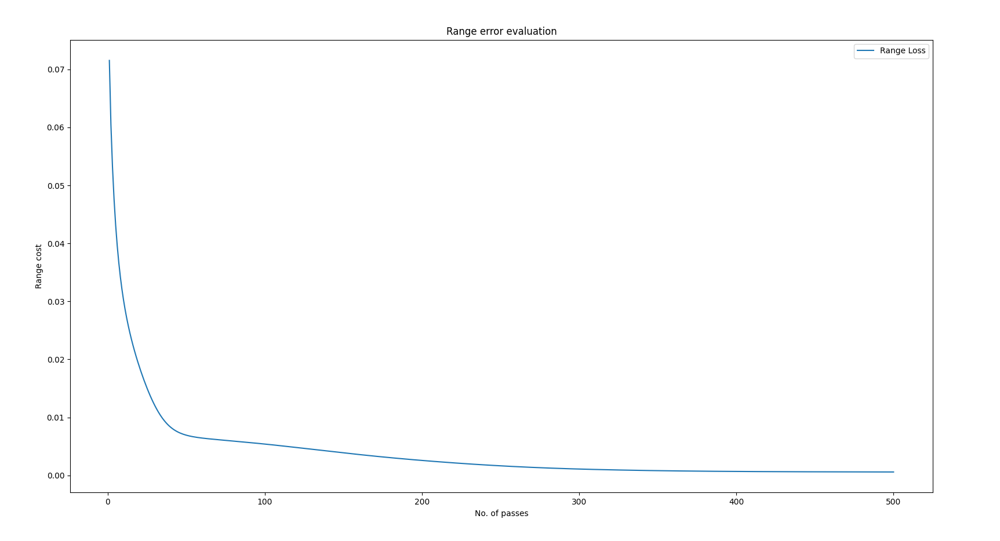

Max height loss:

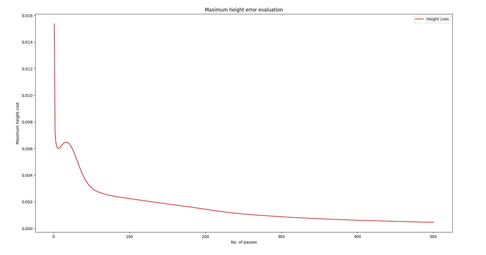

Numerical range predictions:

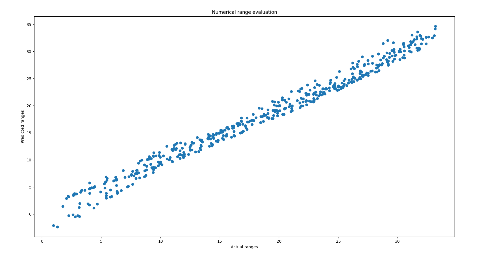

Numerical maximum height predictions:

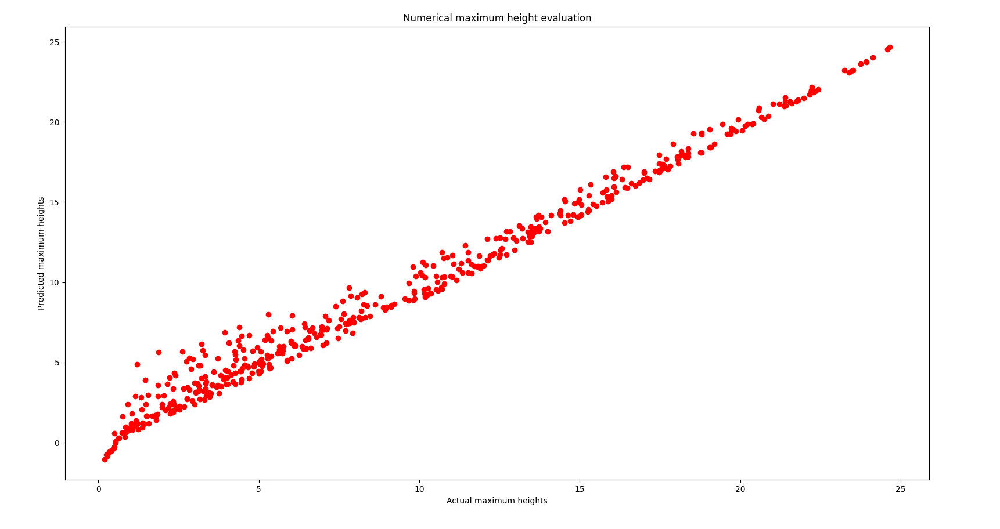